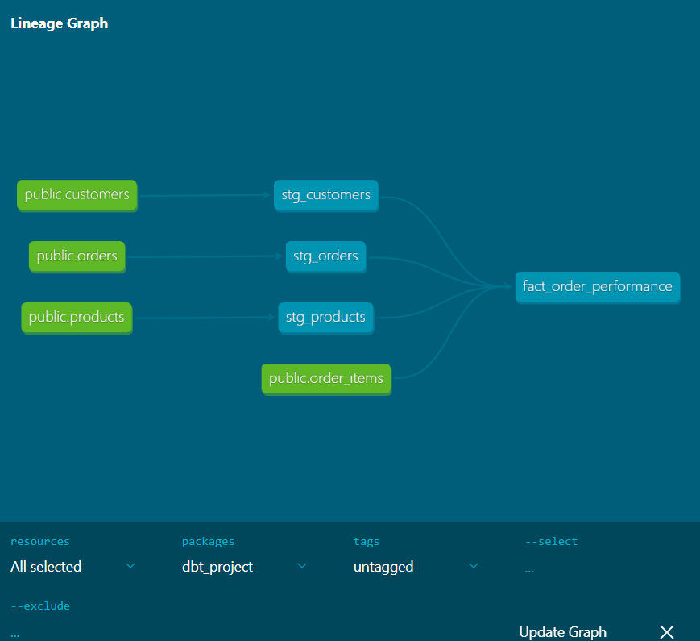

# 🇧🇷 Olist E-Commerce Data Warehouse


**A production-ready, containerized Analytics Engineering pipeline** designed to transform raw Brazilian E-Commerce public data into a structured, business-ready Data Warehouse.

This project demonstrates **Modern Data Stack (MDS)** best practices, facilitating the shift from traditional ETL to a scalable **ELT (Extract, Load, Transform)** pattern using PostgreSQL and dbt.

## 🏗️ System Architecture

The pipeline implements the **Medallion Architecture** to ensure data quality and lineage:

<p align="center">
  
  <br>
  <em>Figure 1: High-level System Architecture - From Raw CSVs to Analytics Ready Star Schema.</em>
</p>

1. **Bronze Layer (Raw):** Bulk ingestion of raw CSV data into PostgreSQL.
2. **Silver Layer (Staging):** Data cleaning, type casting, and standardization using **dbt**.
3. **Gold Layer (Serving):** Business-logic modeling into a **Star Schema** (Facts & Dimensions) optimized for BI tools.

<p align="center">
  
  <br>
  <em>Figure 2: dbt Lineage Graph showing data flow from Bronze to Gold layer.</em>
</p>

## 🚀 Key Engineering Features

- **Dimensional Modeling:** Implements **Kimball’s Star Schema** methodology, creating optimized `fact_orders` and associated dimension tables (`dim_customers`, `dim_products`) for high-performance querying.
- **Infrastructure as Code (IaC):** Fully containerized environment using **Docker Compose**, ensuring reproducibility across different OS (Linux/WSL2/macOS).
- **Automated Data Quality:** Integrated **dbt tests** to validate primary keys, referential integrity, and non-null constraints automatically during the build process.
- **Modular Transformation:** Utilizes CTEs (Common Table Expressions) and modular SQL within dbt to keep transformation logic readable and maintainable.

## 📁 Repository Structure

```text
olist-analytics-pipeline/
├── dbt_project/          # dbt models, tests, and snapshots (Transformation Logic)
│   ├── models/
│   │   ├── staging/      # Silver Layer views
│   │   └── core/         # Gold Layer tables (Star Schema)
├── data/                 # Raw source CSV files (Olist Dataset)
├── ingest_data.py        # Python scripts for initial bulk loading
├── docker-compose.yml    # Container Orchestration
└── README.md             # Project Documentation

```

## 🛠️ Quick Start Guide

Follow these steps to deploy the data warehouse locally:

### 1. Clone the Repository

```bash
git clone https://github.com/KMoex-HZ/olist-analytics-pipeline.git
cd olist-analytics-pipeline

```

### 2. Spin Up Infrastructure

Launch the PostgreSQL database service in detached mode.

```bash
docker-compose up -d

```

### 3. Ingest Raw Data

Run the Python ingestion script to load raw CSVs into the Bronze layer.

```bash
python ingest_data.py

```

### 4. Run Transformations (dbt)

Navigate to the dbt project directory, install dependencies, and run the models.

```bash
cd dbt_project
dbt deps
dbt run
dbt test

```

## 🔮 Future Improvements

- **Orchestration:** Integrate **Apache Airflow** or **Dagster** to schedule daily data refreshes.
- **BI Integration:** Connect **Metabase** or **Superset** for real-time dashboarding of sales performance.
- **CI/CD:** Implement **GitHub Actions** to automate dbt testing on every pull request.

---

## ⚠️ Production Considerations & Roadmap

While this project demonstrates a functional ELT pipeline using the Modern Data Stack (dbt, Docker, Postgres), the following architectural improvements are planned for a production-scale deployment:

1.  **Ingestion Scalability:**
    * *Current:* Uses Pandas `to_sql` for rapid prototyping of initial data loads.
    * *Production Plan:* Refactor to use PostgreSQL `COPY` command or incremental loading logic (Upsert) to handle GB-scale datasets without memory bottlenecks.

2.  **Strict Medallion Architecture:**
    * *Current:* Some Gold layer models reference Bronze sources directly for speed.
    * *Production Plan:* Enforce strict layer isolation where Gold models only reference Silver (Staging) views to ensure complete data lineage and cleaner dependency graphs.

3.  **Dimensional Modeling Refinement:**
    * *Current:* Implements a "One-Big-Table" (OBT) approach in `fact_orders` for immediate BI consumption.
    * *Production Plan:* Fully materialize `dim_customers` and `dim_products` as separate tables to strictly adhere to Kimball’s Star Schema principles.

4.  **Security Best Practices:**
    * *Current:* Hardcoded credentials for local Docker networking convenience.
    * *Production Plan:* Externalize all secrets using `.env` files and Docker Secrets management.
---

**Author:** Caelan Zhou
**License:** MIT License
